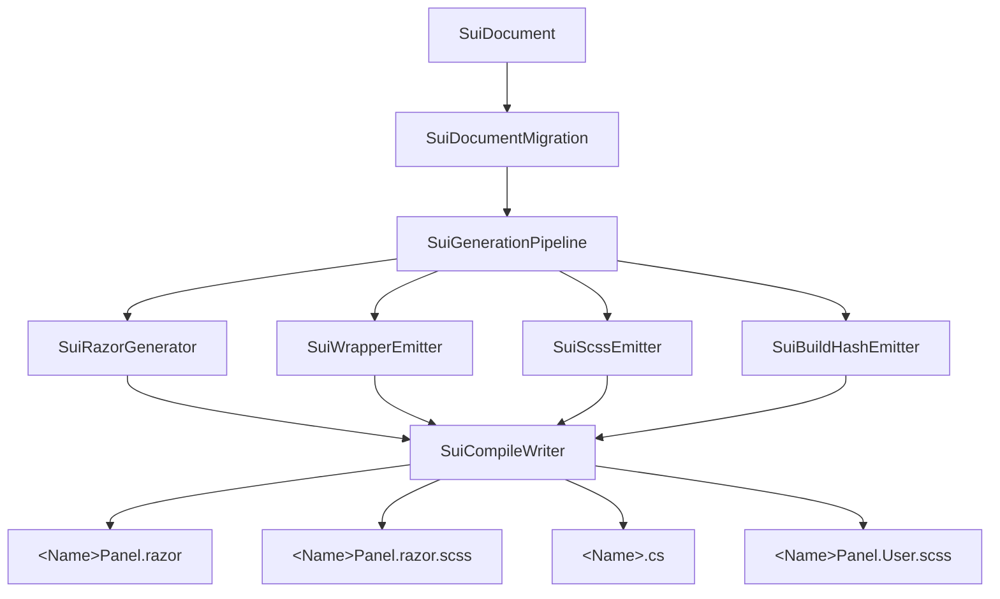

# Generator pipeline
{: .no_toc }

How a `.sui` document becomes a pair of in-memory `.razor` + `.razor.scss` strings — the pure-function half of compilation.
{: .fs-6 .fw-300 }

## Table of contents
{: .no_toc .text-delta }

- TOC
{:toc}

---

## Inputs and outputs

```csharp
public sealed class SuiGenerationContext
{
    public SuiDocument Document { get; set; }
    public SuiGenerationMode Mode { get; set; }     // Preview | Final
    public string OutputFolder { get; set; }        // project-relative
    public string ClassName { get; set; }           // defaults to Document.Output.ClassName
    public string Namespace { get; set; }           // defaults to Document.Output.Namespace
}

public enum SuiGenerationMode { Preview, Final }

var result = SuiGenerationPipeline.Run( ctx );
// result.Files = [ { Kind: Razor, Path: "...", Content: "...", Hash: "..." }, ... ]
// result.Errors / Warnings / Infos
```

Pure function: no disk writes, no side effects. The compile writer (separate component) takes the result and persists it. See [Compile writer]().

Source: [Code/Generation/SuiGenerationPipeline.cs](https://github.com/KiKoZl1/sbox-ui-designer/blob/main/Code/Generation/SuiGenerationPipeline.cs).

## Pipeline stages



<details>
<summary>ASCII version</summary>

```
SuiDocument
    │
    ▼
1. SuiDocumentValidator        (cycles, dup IDs, missing root → bail)
    │
    ▼
2. Resolve ClassName + Namespace
    │
    ▼
3. SuiRazorGenerator           → in-memory Razor string
    │
    ▼
4. SuiScssGenerator            → in-memory SCSS string
    │
    ▼
5. Pack into SuiGenerationResult (files + hashes + diagnostics)
```

</details>

If validation fails the pipeline returns early with errors — no Razor or SCSS is produced.

## Mode: Preview vs Final

The same generator runs in both modes. Two differences in output:

### 1. Namespace suffix

```csharp
if ( ctx.Mode == SuiGenerationMode.Preview && !ctx.Namespace.EndsWith( ".SuiPreview" ) )
    ctx.Namespace = ctx.Namespace + ".SuiPreview";
```

So `Game.UI.MyHudPanel` (Final renderer) becomes `Game.UI.SuiPreview.MyHudPanel` (Preview renderer). This prevents `CS0111: duplicate render-tree members` when a document is **both** compiled to disk AND has a live preview cache — they would otherwise be two `partial class MyHudPanel` declarations in the same namespace.

### 2. User.scss `@import`

The Final SCSS ends with:

```scss
// User-protected styles for MyHudPanel — safe to edit.
@import "MyHudPanel.User.scss";
```

The Preview SCSS does NOT emit this `@import`. The preview cache path doesn't have a sidecar — and importing a non-existent file silently breaks SCSS compilation at runtime (leaving the UI unstyled). The fix is to emit the import only in Final mode.

That's it. Every other output detail is identical.

## The Razor generator

`SuiRazorGenerator.Generate(ctx, result)` walks the document tree and emits:

```razor
@namespace Game.UI
@using System;
@using Sandbox;
@using Sandbox.UI;
@inherits Panel

<root>
  <div class="root sui-el-root">
    <div class="health-bar sui-el-a3f9b21c">
      ...
    </div>
  </div>
</root>

@code
{
    protected override int BuildHash() => System.HashCode.Combine( /* every Variable + every child wrapper.ContentHash() + interactive flags */ );
}
```

Notable shapes:

- **`@inherits Panel` (NOT `PanelComponent`)** — V1.5-M2-K7 (D-014) split the emitted types so the renderer class is a plain `Panel` that can be nested inside other generated `.sui` markup via `<Game.UI.<Name>Panel />`. Standalone mounting goes through `SuiPanel<TView>.Add()`, which spawns a `SuiHostPanelComponent` (a real `PanelComponent`) + `ScreenPanel` and attaches the inner `Panel` as a child.
- **No `@attribute [StyleSheet]`** — the stylesheet is paired by filename convention (`<Name>Panel.razor` + `<Name>Panel.razor.scss`); the generator does not emit a `[StyleSheet]` attribute.
- **Element class-string emission (D-021)** — every element's `class=` is rendered as a dispatch to a private helper, e.g. `class="@RootClass()"`, where the `@code` block defines `private string RootClass() => $"root sui-el-root{(IsDisabled ? \" is-disabled\" : \"\")}";`. The earlier mixed-content shape `class="root sui-el-root @(IsDisabled ? "is-disabled" : "")"` broke the s&box Razor parser mid-M3.5, so all reactive class folding now goes through helper methods. Inspect the helper, not the element tag, to see how toggles like `IsDisabled` join the class list.
- **Every element gets a `sui-<id>` class** (e.g. `sui-el-a3f9b21c`) alongside its user-defined `ClassName`. This per-element class is what scopes SCSS rules to a single element — without it, siblings sharing a `ClassName` would all inherit the same rules (bug-prone for InventorySlot lists). The shape is `sui-<sanitized-id>`; see `SuiRazorGenerator.ElementUniqueClass`.
- **The markup is wrapped in `<root>`** and the SCSS outer selector is `<Name>Panel { ... }` (Final mode renames the renderer to `<Name>Panel` so the wrapper class can keep the user-facing `<Name>`). The `<root>` tag is required by the Razor parser; SCSS targets the renderer's class name, not the literal tag.
- **Text elements emit `<label>`**, others emit `<div>` (or `<button>`, `` for those types).
- **`BuildHash()`** is an override emitted by `SuiBuildHashEmitter` that combines every Variable referenced by any non-`OneTime` binding, every embedded child wrapper's recursive `ContentHash()`, and interactive-state flags so any reactive change forces `BuildRenderTree` to re-run. See [Reactivity & BuildHash]().

The Razor doesn't include the SUI:GENERATED header — that's added by the compile writer when the file is actually written to disk (so editing the in-memory output doesn't see the header).

## The SCSS generator

`SuiScssGenerator.Generate(ctx, result)` is the bulk of the generator complexity. It walks the document tree and emits CSS rules per element.

### Nesting structure

```scss
MyHudPanel {                      // outer = <Name>Panel (Final mode renames renderer)
  flex-direction: column;
  background-color: #0a0a0a;

  .sui-el-a3f9b21c {              // per-element unique class — sui-<sanitized-id>
    position: absolute;
    left: 40px;
    top: 40px;
    width: 200px;
    height: 18px;
    background-color: rgba(0,0,0,0.5);
  }

  .sui-el-c12db04e {
    ...
  }

  // ProgressBar nested fill rule
  .sui-el-a3f9b21c .progress-fill {
    background-color: #ef4444;
  }
}

// Final mode only — user-protected styles for MyHudPanel:
@import "MyHudPanel.User.scss";
```

The whole document compiles into a single nested SCSS block. Two-space indent. Stable output across edits (sorted by element ID where order doesn't matter visually). The `@import` sits at file scope (not nested inside the outer selector) so the `.User.scss` sidecar authors its own top-level `MyHudPanel { ... }` block — matching the boilerplate the compile writer creates on first emit.

### Anchor → CSS translation

The 9-anchor + pivot model from the document compiles into CSS like:

| Anchor | CSS emitted |
|---|---|
| TopLeft | `position: absolute; left: X; top: Y;` |
| TopCenter | `position: absolute; left: 50%; top: Y; transform: translateX(-50%);` |
| MiddleCenter | `position: absolute; left: 50%; top: 50%; transform: translate(-50%, -50%);` |
| BottomRight | `position: absolute; right: X; bottom: Y;` |
| Stretch | `position: absolute; left: X; top: Y; right: W; bottom: H;` |

The math mirrors `SuiLayoutSolver.ResolveAbsoluteRect` 1:1.

### Property emission rules

For every CSS property the generator emits, it passes through `SuiAllowedPropertyList.Validate(property, value)`. Rejected properties surface as `Errors` in the result — the compile aborts. This blocks the most common class of bug: a renderable-on-web property that s&box silently ignores.

What's allowed: see [Allowed CSS reference]().

### Skipped emissions

The generator deliberately doesn't emit:

- `width: 8px; height: 8px;` when anchor is `Stretch` — those fields are margins, not size. Emitting them collapses the element.
- `position: relative` (default) — only emit on flex items that need it for absolute children.
- Per-type defaults — `background-color: transparent` is the default, no need to write it.
- `display: flex` outside flex containers — wastes a rule.

Defaults stay implicit because every emitted rule is a chance for typo/drift.

### Type-specific blocks

Each element type may emit additional nested rules:

- **Button** — nested `.label` rule for the inner text (font, color, align).
- **ProgressBar** — nested `.progress-fill` rule with width based on `PreviewValue`.
- **Image** — `background-image: url(/path)` + `background-size: cover` (or `contain` per `FitMode`).
- **ItemIcon** — emits `background-image` from `PreviewIconPath` if present.
- **Grid / InventoryGrid** — wrapped flex translation (CSS Grid is forbidden in s&box).

### Special: Grid mapping

CSS Grid (`display: grid`) is forbidden by the allowed-property list — s&box's Yoga engine doesn't support it. SUI's Grid element maps to **wrapped flex**:

```scss
.sui-grid {
  display: flex;
  flex-direction: row;
  flex-wrap: wrap;
  gap: 4px;
}
.sui-grid > * {
  width: 64px;
  height: 64px;
}
```

This matches what the canvas's `SolveGrid` does — both produce a regular tile pattern with row wrapping.

## Hashing

Every file in the result carries a SHA-256 of its content (`SuiHashUtility.Sha256`). The compile writer uses this to skip "same hash, no-op" writes, avoiding the expensive engine hot-reload trigger.

## Error and warning surfaces

The result has 3 diagnostic levels:

- `Errors` — block the compile (validator failures, disallowed properties).
- `Warnings` — proceed but surface in Compile Results (`ClassName` collision, missing image asset).
- `Infos` — generator narration (skipped no-op files, emit counts).

All surfaced in the [Compile Results panel]().

## What the generator does NOT do

- **Doesn't touch the filesystem** — that's the compile writer's job.
- **Doesn't add the SUI:GENERATED header** — also the writer.
- **Doesn't read or write the manifest** — also the writer.
- **Doesn't run SCSS compilation** — outputs source SCSS, the s&box engine compiles it at load.

In Final mode the pipeline emits **three** artefacts, not two: `<Name>Panel.razor`, `<Name>Panel.razor.scss`, AND `<Name>.cs` — the wrapper class extending `SuiPanel<<Name>Panel>` with `Add` / `Show` / `Hide` / `Remove`, per-Variable `[Property]` mirrors, named-instance fields for embedded `SuiReference`s, an `Apply` namespace for Manual-trigger bindings, and a recursive `ContentHash()`. Emitted by `SuiWrapperEmitter` and wired in `SuiGenerationPipeline.Run` (Final mode only — preview cache stays markup-only so hot-reload doesn't re-spawn Components per frame). See [Compile writer]() for the disk layout.

The strict pure-function boundary makes testing and offline reasoning easy: you can run the generator from a unit test with a synthetic `SuiDocument` and assert on the emitted strings.

## See also

- [Compile writer]() — what consumes the result
- [Document model]() — what feeds the generator
- [Allowed CSS]() — the property whitelist
