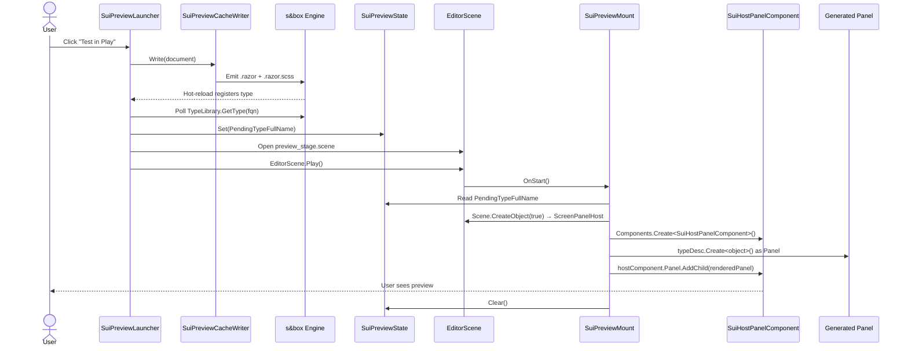

# Preview system
{: .no_toc }

How the "Test in Play" button compiles a `.sui` into a real `Panel` (wrapped by `SuiHostPanelComponent` at mount time), opens a stage scene, and mounts the UI on a player at runtime.
{: .fs-6 .fw-300 }

## Table of contents
{: .no_toc .text-delta }

- TOC
{:toc}

---

## Goal

Let the user see their UI rendered by **the real s&box CSS engine** on a real player, without leaving the SUI Designer workflow. One click → playing.

The canvas preview is fast and round-trippable but it's a separate render path ([Canvas renderer]()). The preview system uses the actual engine — Yoga layout, runtime SCSS compilation, real ScreenPanel — so you see exactly what ships.

## Sequence

### Full sequence



<details>
<summary>ASCII version</summary>

```
User clicks "Test in Play"
        │
        ▼
SuiPreviewLauncher.Launch( document )
        │
        ├──▶ SuiPreviewCacheWriter.Write( document )
        │      ├── Generate via SuiGenerationPipeline (Mode.Preview)
        │      ├── Write Code/_sui_preview/<ClassName>/<ClassName>.razor
        │      └── Write Code/_sui_preview/<ClassName>/<ClassName>.razor.scss
        │
        │      → engine hot-reloads → Panel type registers in TypeLibrary
        │
        ├──▶ Poll TypeLibrary.GetType( fqn ) — up to 6 seconds
        │
        ├──▶ SuiPreviewState.Set( fqn )
        │
        ├──▶ AssetSystem.FindByPath( "sui_preview/preview_stage.scene" )
        │      .OpenInEditor()
        │
        └──▶ EditorScene.Play( session )
                │
                ▼
        Scene loads. SuiPreviewMount.OnStart() fires (NOT OnAwake — Play has begun):
                ├── Reads SuiPreviewState.PendingTypeFullName
                ├── Looks up TypeDescription
                ├── Scene.CreateObject(true) → "ScreenPanelHost"
                ├── Adds ScreenPanel component
                ├── Adds SuiHostPanelComponent (PanelComponent wrapper)
                ├── typeDesc.Create<object>() cast to Panel
                ├── hostComponent.Panel.AddChild( renderedPanel )
                └── Clears SuiPreviewState
```

</details>

5 steps. The launcher does steps 1–5; the in-scene `SuiPreviewMount` does the actual mount in step 5.

> **Why `OnStart` and not `OnAwake`?** Because `OnAwake` fires at scene load — which is still editor mode when the launcher opens the scene. At that point `Components.Create<>` does not synchronously drive the `OnEnabled` chain, so the host component's `Panel` field stays null. `OnStart` fires after `EditorScene.Play` begins, when the lifecycle chain has run.

## The three pieces

### 1. Preview cache writer (`SuiPreviewCacheWriter`)

Same generator output as the final compile, written to a different folder:

```
Code/_sui_preview/<ClassName>/
  ├── <ClassName>.razor        (Game.UI.SuiPreview.<ClassName>)
  └── <ClassName>.razor.scss
```

Why under `Code/`? Because the s&box Razor compiler only picks up `.razor` files inside `Code/`. Outside that path the file gets ignored.

Why `.SuiPreview` sub-namespace? Without it, the preview file would declare `partial class MyHud` in `Game.UI` — the same as the final compile output. The engine raises `CS0111: duplicate render-tree members`. Adding `.SuiPreview` makes them distinct types (`Game.UI.SuiPreview.MyHud` vs `Game.UI.MyHud`) — coexistence works.

Why no `.User.scss`? Because the sidecar file doesn't exist at this path. The generator skips the `@import` in Preview mode for exactly this reason — see [Generator pipeline](#mode-preview-vs-final).

### 2. State handoff (`SuiPreviewState`)

A static class with a single string:

```csharp
public static class SuiPreviewState
{
    public static string PendingTypeFullName { get; private set; }

    public static void Set( string typeFullName ) { PendingTypeFullName = typeFullName; }
    public static void Clear()                    { PendingTypeFullName = null; }
}
```

The launcher sets it before invoking `EditorScene.Play`. The in-scene `SuiPreviewMount` reads it in `OnStart` and clears it. The launcher and mount run in different "process modes" (editor vs play) — sharing state via a static is the simplest cross-mode handoff.

### 3. In-scene mount (`SuiPreviewMount`)

Lives on a GameObject in `preview_stage.scene`. The scene is bundled with the addon:

```
Libraries/kikozl.sbox_ui_designer/Assets/sui_preview/preview_stage.scene
```

Contains:

- A ground plane
- A skybox / ambient light
- A player prefab (TPS character so you can move around)
- A GameObject with `SuiPreviewMount` attached

On `OnStart` (not `OnAwake` — see sequence note above):

```csharp
var fqn = SuiPreviewState.PendingTypeFullName;
if ( string.IsNullOrEmpty( fqn ) ) return;

var typeDesc = TypeLibrary.GetType( fqn );
if ( typeDesc == null ) return;

// Scene.CreateObject(true) attaches the GO to the scene synchronously
// and fires the OnAwake → OnEnabled chain inline, so the host's Panel
// field is populated by the time we call AddChild below.
_panelHost = Scene.CreateObject( true );
_panelHost.Name = "ScreenPanelHost";
_panelHost.SetParent( GameObject );
_panelHost.Components.Create<ScreenPanel>();

// The generated class is a Panel subclass (not a Component), so we host
// a SuiHostPanelComponent (PanelComponent with an empty render tree)
// and add the generated Panel as a child of its root Panel.
var hostComponent = _panelHost.Components.Create<SuiHostPanelComponent>();
if ( hostComponent?.Panel == null ) return;

var instance = typeDesc.Create<object>();
if ( instance is not Panel renderedPanel ) return;

hostComponent.Panel.AddChild( renderedPanel );

SuiPreviewState.Clear();
```

`ScreenPanel` is the screen-space root needed by any `PanelComponent` to render as a HUD overlay. Without it the panel is in the scene but has no draw surface. `SuiHostPanelComponent` is the `PanelComponent` wrapper that exposes a root `Panel` we can `AddChild` the generated Panel onto (since `@inherits Panel` types aren't components themselves).

## Why the polling step?

After writing the `.razor` file, the engine needs to:

1. Notice the file system change.
2. Compile it via the Razor compiler.
3. Register the new `Panel` type (wrapped by `SuiHostPanelComponent` at mount time) in `TypeLibrary`.

This is asynchronous. Typical latency: 200–800 ms. The launcher polls `TypeLibrary.GetType(fqn)` every 100 ms up to 60 attempts (= 6 seconds).

If the type doesn't appear in 6 s, the launcher gives up with a warning. The common cause is a SCSS or Razor compile error — visible in the engine console. Common culprits:

- `display: grid` in `.User.scss` (engine doesn't support it).
- `rgba()` typo in a color value.
- Hand-edited `.razor` with C# syntax errors.

## Why open a scene? Can't we just mount on the current one?

Two reasons:

1. **Determinism** — your current scene might be empty, full of dev objects, or have its own conflicting HUDs. A bundled stage gives a clean baseline.
2. **API constraint** — `EditorScene.Play` requires a scene to play. Mounting on an in-flight scene means hijacking whatever was open.

The trade-off: after you stop play, you remain on `preview_stage.scene`. You re-open your real scene manually from the Asset Browser. There's no "restore previous scene" API in s&box that the addon can use safely.

## Preview cache vs final compile

| | Preview cache | Final compile |
|---|---|---|
| Folder | `Code/_sui_preview/<ClassName>/` | User-picked (typically `Code/UI/`) |
| Namespace | `Game.UI.SuiPreview.<ClassName>` | `Game.UI.<ClassName>` (or doc-configured) |
| `@import "<Name>.User.scss"` | **No** (sidecar doesn't exist here) | **Yes** |
| `.User.scss` sidecar | Not written | Written once |
| SUI:GENERATED header | Yes (same as final) | Yes |
| Manifest entry | No (preview doesn't track manifest) | Yes |
| Backup on overwrite | No (transient cache) | Yes |
| Engine hot-reload | Yes | Yes |

Preview cache is a transient working area — the user never opens those files directly. Cleaning preview caches is part of Tools → Clean SUI Caches.

## Limitations

- **No `.User.scss` styles** — sidecar isn't imported in Preview mode. If you have hovers, animations, or shadows in `.User.scss`, they won't appear in Test in Play. Use real Compile + Play to see them.
- **One Play at a time** — s&box doesn't nest play sessions.
- **No scene auto-restore** — after Stop, you're on `preview_stage.scene`.
- **No window minimize** — the SUI Designer window stays where it was. To see the Scene Viewport that's playing, switch tabs.
- **Stack count badges missing** — `PreviewCount` on InventorySlot/ItemIcon shows in canvas but not in runtime yet. Tracked as [ISSUE-005](https://github.com/KiKoZl1/sbox-ui-designer/blob/main/ISSUES.md#issue-005).
- **`<label>` rgba alpha quirk** — `<label>` elements may render `background-color` rgba as opaque. Workaround: wrap text in a Panel. Tracked as [ISSUE-004](https://github.com/KiKoZl1/sbox-ui-designer/blob/main/ISSUES.md#issue-004).

## Diagnostics

The launcher and mount log to the engine console:

| Message | Meaning |
|---|---|
| `[SuiPreviewLauncher] Compiled '<fqn>'` | Step 1 OK |
| `[SuiPreviewLauncher] Type loaded: <fqn>` | Step 2 OK |
| `[SuiPreviewLauncher] Opened preview stage scene.` | Step 4 OK |
| `[SuiPreviewLauncher] EditorScene.Play() invoked.` | Step 5 OK |
| `[SuiPreviewMount] Mounted '<fqn>' on ScreenPanel.` | Final mount OK — UI should appear |
| `Timed out waiting for type ... to compile` | SCSS/Razor compile error — check console |
| `Preview stage not found at ...` | Addon Assets folder broken — reinstall |
| `Already in Play.` | Stop the current play session first |
| `[SuiPreviewMount] No PendingTypeFullName set` | Scene was opened without the launcher — re-click Test in Play |

## See also

- [Test in Play workflow]() — user-facing version
- [Generator pipeline]() — Preview vs Final mode differences
- [Known issues]() — ISSUE-004 / ISSUE-005
